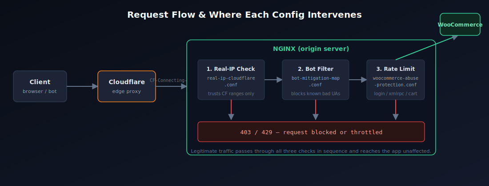

# NGINX Security Hardening Kit

**Production-grade NGINX configs that close a common Cloudflare real-IP spoofing hole, stop bot/scraper abuse, and rate-limit the WordPress/WooCommerce endpoints attackers actually target.**

Built from real production hardening work managing live e-commerce infrastructure — rebuilt here as clean, documented, reusable configs that anyone can audit, adapt, and deploy.

---

## The problem this addresses

Most sites behind Cloudflare have a gap nobody notices until it's exploited: **NGINX trusts the visitor's real-IP header from anyone, not just Cloudflare.**

That means an attacker who finds your origin server's real IP can bypass Cloudflare entirely, forge the real-IP header by hand, and:
- Defeat IP-based rate limiting and bans
- Poison your access logs with a fake source IP
- Make incident response and forensics unreliable

It's a common misconfiguration because the site *works fine either way* — there's no visible symptom until someone actively abuses it. Full technical breakdown: [`docs/the-vulnerability.md`](docs/the-vulnerability.md).

## What's included

| File | What it does |
|---|---|
| `conf.d/real-ip-cloudflare.conf` | Restricts real-IP header trust to Cloudflare's actual published edge ranges |
| `conf.d/bot-mitigation-map.conf` | Blocks known scraper, scanner, and vulnerability-tool user agents |
| `conf.d/woocommerce-abuse-protection.conf` | Rate-limits `wp-login.php`, `xmlrpc.php`, `wc-ajax`, and `admin-ajax.php` |
| `docs/the-vulnerability.md` | Plain-language explanation of the real-IP spoofing issue and how to test for it |
| `docs/request-flow-diagram.png` | Visual of where each config intervenes in the request path |

## Where this came from

Built from hands-on hardening work managing production infrastructure for a live multi-site WooCommerce operation — closing a real-IP spoofing vulnerability, blocking sustained bot/scraper abuse, and stopping checkout-parameter abuse attempts. Client details aren't shared here; these configs are generalized, rebuilt reference implementations of that same work.

## How to deploy this

1. **Verify current IP ranges.** Cloudflare's edge ranges change occasionally — confirm against [cloudflare.com/ips-v4](https://www.cloudflare.com/ips-v4) and [ips-v6](https://www.cloudflare.com/ips-v6) before deploying.
2. **Copy configs in.** Place the relevant `.conf` files in your NGINX `conf.d/` (or `sites-available/`, depending on your setup).
3. **Include them.** Reference each file from your `http{}` and `server{}` blocks — usage is commented at the top of each config.
4. **Test syntax.** Run `nginx -t` before reloading anything.
5. **Reload, don't restart.** `systemctl reload nginx` avoids dropping active connections.
6. **Verify.** Follow the manual test in `docs/the-vulnerability.md`, and watch logs for unexpected 429s from the rate limits over the first 24–48 hours.

**Test in staging first.** These are strong, correct starting points — not one-size-fits-all guarantees. Tune rate limits to your real traffic, and audit the bot-agent list against any legitimate integrations you run (uptime monitors, webhooks, etc.) before enabling in production.

## Stack

NGINX · Linux · Cloudflare

## About me

I'm Iftikhar — an infrastructure/DevOps engineer who fixes the things costing businesses uptime, security, or peace of mind. I work across AWS, Azure, and production Linux servers, and I manage live infrastructure for paying clients today, not just personal projects.

- **Portfolio:** [iftu-automation.click](https://iftu-automation.click)
- **LinkedIn:** [linkedin.com/in/iftikhar-aly](https://www.linkedin.com/in/iftikhar-aly/)

If your server's security or stability is costing you sleep, [message me on LinkedIn](https://www.linkedin.com/in/iftikhar-aly/) — tell me what's actually broken, and I'll tell you straight whether I can fix it.

## License

MIT — use, adapt, and deploy freely.
